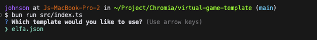

# virtual-game-template

Virtual Game Template makes use of Mustache(5). Please read the [Official docs](https://mustache.github.io/mustache.5.html) to understand how templating works.

Here's how the tool works:



## Supported Template
### Elfa
Visit https://elfa.ai to learn more.

## Getting Started

### Prerequisites
- Node.js installed on your system
- API keys for Elfa.ai

### Installation
1. Clone this repository

```bash
git clone https://github.com/yourusername/virtual-game-template.git
cd virtual-game-template
```

2. Install dependencies
```bash
bun install
```

3. Configure your API keys
```bash
cp .env.sample .env
```
Then update your API keys in the config file.

### Usage
Run the CLI tool using:

